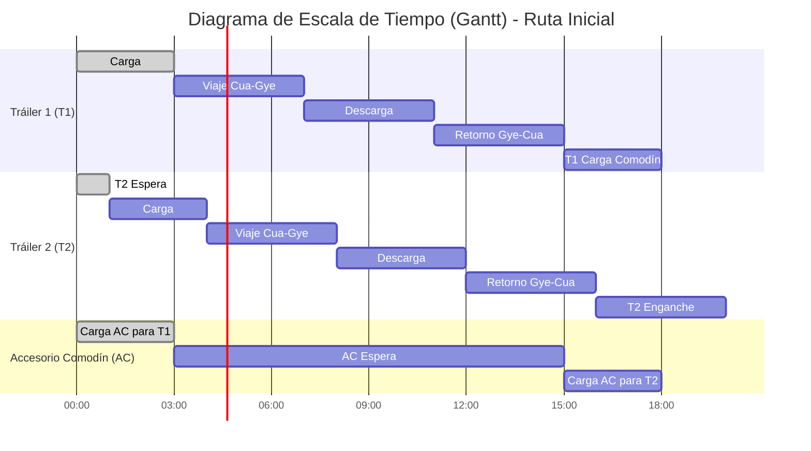

# codigo-k
# Diagrama de Gantt - Ruta Inicial

```mermaid
gantt
    dateFormat  HH:mm
    axisFormat %H:%M
    title Diagrama de Escala de Tiempo (Gantt) - Ruta Inicial
    
    section Tráiler 1 (T1)
    Carga: done, 00:00, 3h
    Viaje Cua-Gye: 03:00, 4h
    Descarga: 07:00, 4h
    Retorno Gye-Cua: 11:00, 4h
    T1 Carga Comodín: 15:00, 3h
    
    section Tráiler 2 (T2)
    T2 Espera: done, 00:00, 1h
    Carga: 01:00, 3h
    Viaje Cua-Gye: 04:00, 4h
    Descarga: 08:00, 4h
    Retorno Gye-Cua: 12:00, 4h
    T2 Enganche: 16:00, 4h
    
    section Accesorio Comodín (AC)
    Carga AC para T1: done, 00:00, 3h
    AC Espera: 03:00, 12h
    Carga AC para T2: 15:00, 3h
```
